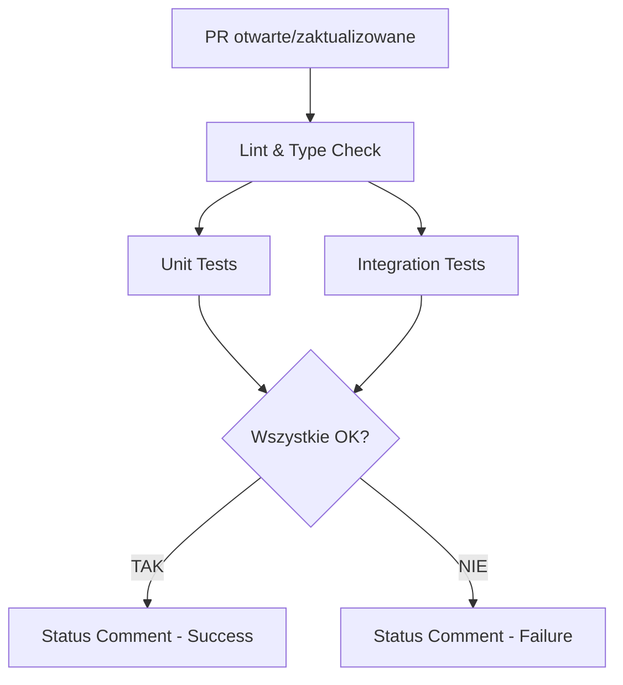

# GitHub Actions - Strategia CI/CD dla KMS

## 📋 Spis Treści

1. [Przegląd](#przegląd)
2. [Struktura Workflow](#struktura-workflow)
3. [Composite Actions](#composite-actions)
4. [Zmienne Środowiskowe](#zmienne-środowiskowe)
5. [Uruchamianie Lokalnie](#uruchamianie-lokalnie)

---

## 🎯 Przegląd

Workflow `pull-request.yml` realizuje strategię CI zgodną z:
- **Metacybernetyką Kosseckiego** (rygor naukowy, sprzężenia zwrotne)
- **Best Practices GitHub Actions** (composite actions, cache, artifacts)
- **Wytycznymi projektu** (`.ai/github-action.mdc`)

### Kluczowe Zasady

✅ **Używamy `npm ci`** zamiast `npm install` (deterministyczna instalacja)  
✅ **Branch `master`** jako główna gałąź  
✅ **Najnowsze wersje akcji** (sprawdzane przez GitHub API)  
✅ **Composite actions** dla powtarzalnych kroków  
✅ **Coverage dla testów** (unit + integration)  
✅ **Komentarze do PR** ze statusem i metrykami

---

## 🔄 Struktura Workflow



### Job 1: Lint & Type Check

**Cel:** Sprawdzenie poprawności typów TypeScript (strict mode)

```yaml
- TypeScript: npx tsc --noEmit
- Strict Mode: Zgodnie z tsconfig.json (wszystkie flagi aktywne)
```

**Czas wykonania:** ~30s

---

### Job 2: Unit Tests (równolegle z Integration)

**Cel:** Testy jednostkowe z pokryciem kodu

```yaml
- Framework: Jest (ts-jest/presets/default-esm)
- Coverage: lcov + html
- Pliki testowe:
  - src/lib/cybernetics/receptor/extractor.test.ts
  - src/lib/cybernetics/homeostat/security-layer.test.ts
  - src/lib/cybernetics/homeostat/contradiction-engine.test.ts
```

**Wyniki:**
- Coverage zapisywane jako artifact (`unit-test-coverage`)
- Raport dostępny przez 7 dni
- Automatyczna analiza % pokrycia

**Czas wykonania:** ~45s - 1min

---

### Job 3: Integration Tests (równolegle z Unit)

**Cel:** Test pełnego obiegu informacji (Receptor → Korelator → Supabase)

```yaml
- Skrypt: npm run test:full (src/scripts/test-run.ts)
- Environment: integration (GitHub Environment z sekretami)
- Wymagania:
  - Połączenie z Supabase
  - Klucze API (Gemini, OpenRouter)
```

**Weryfikacja:**
1. Przetworzenie tekstu przez Receptor
2. Ekstrakcja obiektów cybernetycznych (Korelator)
3. Zapis do bazy danych (Supabase)
4. Sprawdzenie zgodności z teorią Kosseckiego

**Czas wykonania:** ~1-2min (zależnie od API)

---

### Job 4: Status Comment (tylko gdy wszystko OK)

**Warunek:** `needs.lint.result == 'success' && needs.unit-tests.result == 'success' && needs.integration-tests.result == 'success'`

**Zawartość komentarza:**
- ✅ Tabela ze statusami wszystkich jobów
- 📈 Pokrycie kodu (Coverage %)
- 🦾 Zgodność z Metacybernetyką (Receptor/Homeostat/Korelator)
- 📊 Metryki (czas, liczba testów)

---

### Job 5: Failure Comment (gdy coś poszło nie tak)

**Warunek:** Dowolny z poprzednich jobów zakończył się niepowodzeniem

**Zawartość komentarza:**
- ❌ Które joby zawiodły
- 🔧 Konkretne akcje do podjęcia
- 🔗 Linki do logów

---

## 🔧 Composite Actions

### `.github/actions/setup-node-deps`

**Cel:** Ujednolicenie setupu Node.js i instalacji zależności

**Kroki:**
1. Setup Node.js (actions/setup-node@v6)
2. Cache npm (automatyczne)
3. Instalacja zależności (`npm ci`)

**Użycie:**
```yaml
- name: Setup Node.js and dependencies
  uses: ./.github/actions/setup-node-deps
  with:
    node-version: '20'
```

**Zalety:**
- ✅ DRY (Don't Repeat Yourself)
- ✅ Łatwa aktualizacja (jedna zmiana w wielu miejscach)
- ✅ Spójność między jobami

---

## 🔐 Zmienne Środowiskowe

### Wymagane Sekrety (GitHub Secrets)

Konfiguracja w: **Settings → Secrets → Actions**

| Nazwa | Opis | Gdzie używane |
|-------|------|---------------|
| `SUPABASE_URL` | URL instancji Supabase | Integration Tests |
| `SUPABASE_KEY` | Klucz API Supabase (anon/service_role) | Integration Tests |
| `GEMINI_API_KEY` | Google Gemini API Key | Integration Tests |
| `GOOGLE_GENAI_API_KEY` | Alternatywny klucz Gemini | Integration Tests |
| `OPENROUTER_API_KEY` | OpenRouter API Key | Integration Tests |
| `AI_MODEL` | Nazwa modelu AI (opcjonalne) | Integration Tests |

### Environment: integration

**Konfiguracja w:** Settings → Environments → New environment

1. Nazwa: `integration`
2. Dodaj wszystkie powyższe sekrety
3. (Opcjonalnie) Dodaj Required reviewers dla bezpieczeństwa

---

## 🚀 Uruchamianie Lokalnie

### 1. Przygotowanie Środowiska

```bash
# Skopiuj przykładowe zmienne
cp .env.example .env

# Uzupełnij klucze API w .env
# SUPABASE_URL=...
# SUPABASE_KEY=...
# GEMINI_API_KEY=...
```

### 2. Instalacja Zależności

```bash
npm ci
```

### 3. Uruchomienie Poszczególnych Kroków

```bash
# Lint & Type Check
npx tsc --noEmit

# Unit Tests z Coverage
npm run test -- --coverage

# Integration Test
npm run test:full
```

---

## 📊 Metryki i Monitoring

### Coverage Thresholds

| Poziom | Coverage | Status |
|--------|----------|--------|
| 🟢 Excellent | ≥ 80% | ✅ |
| 🟡 Good | 50-79% | ⚠️ |
| 🔴 Poor | < 50% | ❌ |

### Typowe Problemy

#### ❌ Integration Tests Failed

**Przyczyny:**
- Brak połączenia z Supabase
- Nieprawidłowe klucze API
- Limity API (rate limiting)

**Rozwiązanie:**
1. Sprawdź sekrety w GitHub Environment
2. Zweryfikuj statusy usług zewnętrznych
3. Sprawdź logi workflow dla szczegółów

#### ❌ Unit Tests Failed

**Przyczyny:**
- Zmiana w logice biznesowej
- Brakujące mocki
- Timeout testów (domyślnie 60s)

**Rozwiązanie:**
1. Uruchom testy lokalnie: `npm run test`
2. Sprawdź komunikaty błędów
3. Zaktualizuj testy lub napraw kod

---

## 🔄 Aktualizacja Wersji Akcji

Zgodnie z `.ai/github-action.mdc`, sprawdzamy najnowsze wersje przed wdrożeniem:

### PowerShell (Windows)

```powershell
# Sprawdź actions/checkout
(Invoke-RestMethod -Uri 'https://api.github.com/repos/actions/checkout/releases/latest').tag_name -replace 'v'

# Sprawdź actions/setup-node
(Invoke-RestMethod -Uri 'https://api.github.com/repos/actions/setup-node/releases/latest').tag_name -replace 'v'

# Sprawdź actions/upload-artifact
(Invoke-RestMethod -Uri 'https://api.github.com/repos/actions/upload-artifact/releases/latest').tag_name -replace 'v'
```

### Bash (Linux/Mac)

```bash
# Sprawdź actions/checkout
curl -s https://api.github.com/repos/actions/checkout/releases/latest | grep '"tag_name":' | sed -E 's/.*"v([0-9]+).*/\1/'
```

### Obecnie Używane Wersje

| Akcja | Wersja | Sprawdzone |
|-------|--------|------------|
| `actions/checkout` | v6 | ✅ 2025-01-09 |
| `actions/setup-node` | v6 | ✅ 2025-01-09 |
| `actions/upload-artifact` | v6 | ✅ 2025-01-09 |
| `actions/download-artifact` | v7 | ✅ 2025-01-09 |
| `actions/github-script` | v8 | ✅ 2025-01-09 |

---

## 🦾 Zgodność z Metacybernetyką Kosseckiego

### Sprzężenia Zwrotne w CI/CD

| Warstwa | Implementacja | Sprzężenie |
|---------|---------------|------------|
| **Receptor** | Testy walidacji input (extractor.test.ts) | Ujemne (wykrywanie błędów) |
| **Homeostat** | Security Layer (security-layer.test.ts) | Ujemne (stabilizacja) |
| **Korelator** | Integration Tests (test-run.ts) | Dodatnie (wzmacnianie poprawnych ścieżek) |
| **Efektor** | PR Comments (status feedback) | Dodatnie/Ujemne (informacja zwrotna) |

### Homeostaza Systemu

CI/CD działa jako **zewnętrzny homeostat** - stabilizuje system poprzez:
1. Wykrywanie odchyleń (błędów) przed merge
2. Zapobieganie degradacji (coverage threshold)
3. Informację zwrotną dla developerów (PR comments)

---

## 📚 Dodatkowe Zasoby

- [GitHub Actions Documentation](https://docs.github.com/en/actions)
- [Composite Actions Guide](https://docs.github.com/en/actions/creating-actions/creating-a-composite-action)
- [Environment Secrets](https://docs.github.com/en/actions/deployment/targeting-different-environments/using-environments-for-deployment)
- [Metacybernetyka 2015 - J. Kossecki](../METACYBERNETYKA%20-%20Józef%20Kossecki%202015_compressed.pdf)

---

**Autor:** Senior Fullstack Engineer & Metacybernetyka Expert  
**Data:** 2025-01-09  
**Wersja:** 1.0.0

